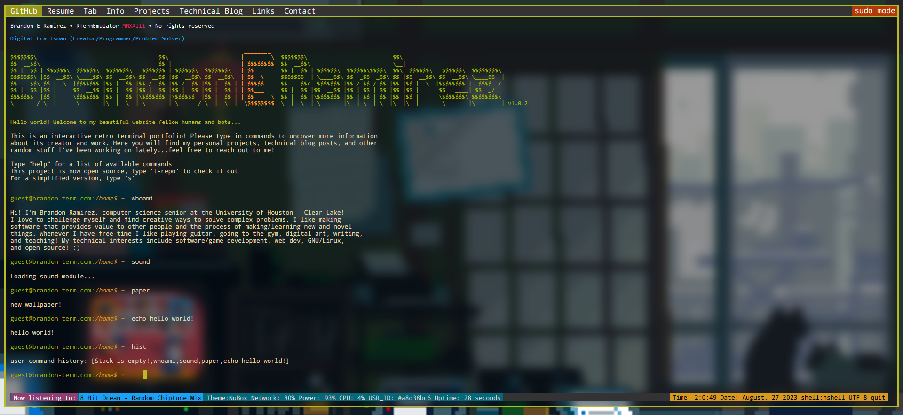
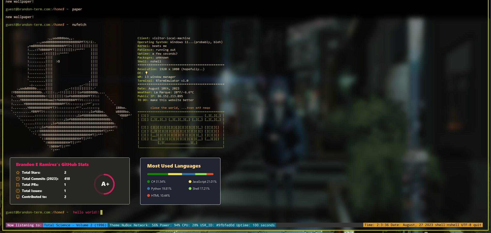

[comment]: <> (About: Files, resources, and assets I will use to create a minimalistic terminal themed browser portfolio)

# terminal_portfolio
Files, resources, and assets I will use to create a minimalistic terminal themed browser portfolio 

I am working on a terminal portfolio made from scratch and deploying it soon with Github pages.
My main goal is to have interactive projects and technical blog posts available.

Feel free to make suggestions!

## Current features
- text changes color when a valid command is provided
- blinking cursor
- simple commands (echo, clear, history)
- memory buffer(press up arrow to load previous commands)
- adding menu bar "|File|Command|Options|Help|Info|Tools|Contact|"
- change wallpaper with "paper"
- play music with "sound"
- guest@brandon-term.com:/home$ ~ + <command> added when command is run 

## Upcoming features
- New color scheme based off my 2 favorites (Monokai + Gruvbox) <!--https://www.w3schools.com/howto/howto_js_typewriter.asp-->
- typing animation
- make keyboard art glow
- adding "bootup" + "typing" sounds
- add easter egg
- add copyright, credits <!--Terminal-styled portfolio by Brandon Ramirez is licensed under a creative commons-->
- including package "downloads" with loading sequence
- (some) vim keybindings
- fortune + programming quote commands
- including simple utilities (calculator, date, weather, etc.)
- "source" command to show website code (syntax highligting)
<!--https://dev.to/ehlo_250/how-to-add-syntax-highlighting-to-code-snippets-on-your-website-app-or-blog-2mi2
https://prismjs.com-->

<!--
##maybe:
-ls to show available files 
-mkdir to create dir 
-make it possible for users to 'change directories'
-"sudo <cmnd>" used to access files/dir with elevated priviledges
-touch "file_name".txt to make a file 
-use 'cat' "file name" to load articles from home dir
-->

## Current bugs
- text dissapears from the left when typing
- border should occupy entire window at all times (especially at beginning)

This is a continually evolving project, please assume all code is in an 
unfinished state unless deployed as a static website here on "Github pages"
